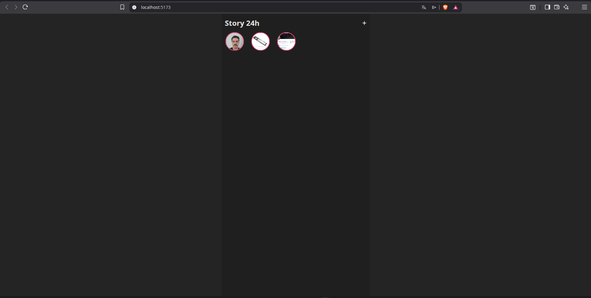

# 📸 Stories 24h - Local-First React App

> Uma aplicação de Stories estilo Instagram que roda 100% no navegador, utilizando IndexedDB para persistência e Canvas API para compressão de imagens.


## 🚀 Sobre o Projeto

Este projeto foi desenvolvido como um desafio técnico focado em **Performance** e **Arquitetura Offline-First**. O objetivo era criar uma experiência de "Stories" onde os dados persistem mesmo após fechar o navegador, sem depender de um backend externo.

O grande diferencial é o tratamento de dados pesados no Front-end:
1.  **Compressão Inteligente:** Imagens de alta resolução são redimensionadas via `Canvas` antes de serem salvas.
2.  **Persistência Binária:** Uso do `IndexedDB` para armazenar blobs de imagem, evitando o limite de 5MB do LocalStorage.
3.  **Consultas Temporais:** Uso de índices (IDBKeyRange) para filtrar apenas stories das últimas 24h.

## 🛠️ Tech Stack

* **Core:** React (Vite) + TypeScript
* **Database:** Native IndexedDB API (Sem bibliotecas externas)
* **Performance:** Canvas API (Image Processing)
* **Estilização:** CSS Modules / Custom CSS

## 🧠 Desafios Técnicos Superados

### 1. "O Problema do Limite de Armazenamento"
Salvar imagens em Base64 no `localStorage` trava o navegador rapidamente.
**Solução:** Implementei uma camada de serviço (`storage.ts`) que gerencia transações no `IndexedDB`, permitindo armazenamento de megabytes de dados de forma assíncrona e segura.

### 2. "Otimização de Imagens no Cliente"
Uploads de câmeras modernas (4K+) pesam muito.
**Solução:** Criei um utilitário (`imageUtils.ts`) que intercepta o arquivo, desenha em um `canvas` off-screen redimensionando para HD (1080x1920) mantendo o aspect ratio, e só então salva o binário comprimido.

## ⚙️ Como Rodar

```bash
# Clone o repositório
git clone [https://github.com/SEU-USUARIO/stories-24h.git](https://github.com/SEU-USUARIO/stories-24h.git)

# Instale as dependências
npm install

# Rode o servidor local
npm run dev
